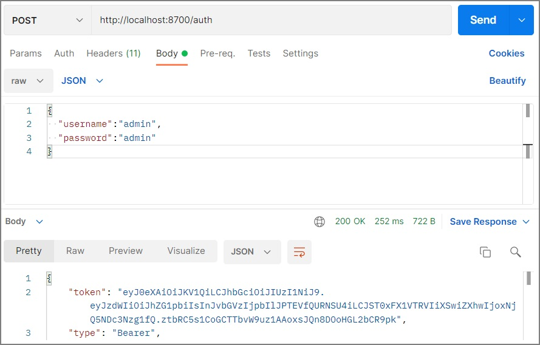
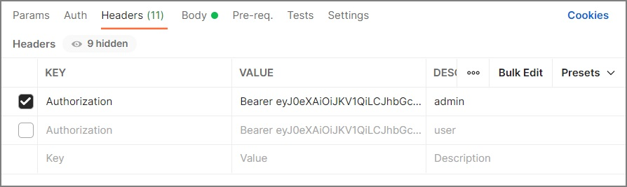

# Микросервис - MainApp
> Для взаимодействия с приложением необходимо использовать Postman (или аналог).

## Руководство по использованию:
### 1. Пройти авторизацию по логину и паролю, получить Bearer токен:
>POST: [localhost:8700/auth](http://localhost:8700/auth)

    {
      "username":"admin",
      "password":"admin"
    }

    {
      "username":"user",
      "password":"user"
    }

> В тело запроса (Body -> raw -> JSON) необходимо вставить пары "username":"логин", "password":"пароль" как показано на рисунке выше.

> После успешной авторизации, вы получите токен аутентификации (в теле ответа), который вам понадобиться на следующем шаге.
---
### 2. Добавить токен аутентификации:

> Для выполнения практически всех запросов необходимо пройти аутентификацию,  
> путем добавления заголовка "Authorization" со значением "Bearer ваш_токен" как показано на рисунке выше.

> Вместо заголовка так же можно использовать вкладку Auth -> Type (Bearer Token) -> ваш_токен.
---
### 3. Ресурсы с разграничением доступа:
> GET: [localhost:8700/test](http://localhost:8700/test)  
> свободный доступ для всех

> GET: [localhost:8700/test/user](http://localhost:8700/test/user)  
> доступ только для ROLE_USER

> GET: [localhost:8700/test/admin](http://localhost:8700/test/admin)  
> доступ только для ROLE_ADMIN
---
### 4. CRUD API:  
> GET : любой авторизованый  
> POST, PUT, DELETE: только ROLE_ADMIN
---
> GET: [localhost:8700/user](http://localhost:8700/user)  
> получить список всех User

> GET: [localhost:8700/user/dto](http://localhost:8700/user/dto)  
> получить список всех UserDTO  
> (!) только для ROLE_ADMIN

> GET: [localhost:8700/user/{id}](http://localhost:8700/user/1)  
> получить User с id = {id}

> POST: [localhost:8700/user](http://localhost:8700/user)  
> создать новый User 

> PUT: [localhost:8700/user](http://localhost:8700/user)  
> изменить существующий User 

> DELETE: [localhost:8700/user/{id}](http://localhost:8700/user/1)  
> удалить User с id = {id}
---
> GET: [localhost:8700/role](http://localhost:8700/role)  
> получить список всех Role

> GET: [localhost:8700/role/{id}](http://localhost:8700/role/1)  
> получить Role с id = {id}

> POST: [localhost:8700/role](http://localhost:8700/role)  
> создать новый Role

> PUT: [localhost:8700/role](http://localhost:8700/role)  
> изменить существующий Role

> DELETE: [localhost:8700/role/{id}](http://localhost:8700/role/1)  
> удалить Role с id = {id}
---
